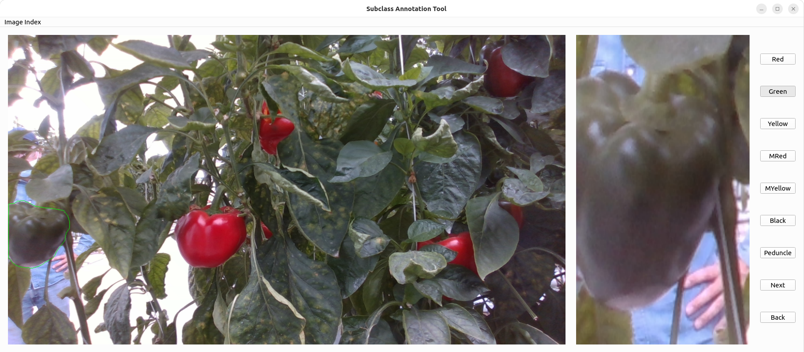
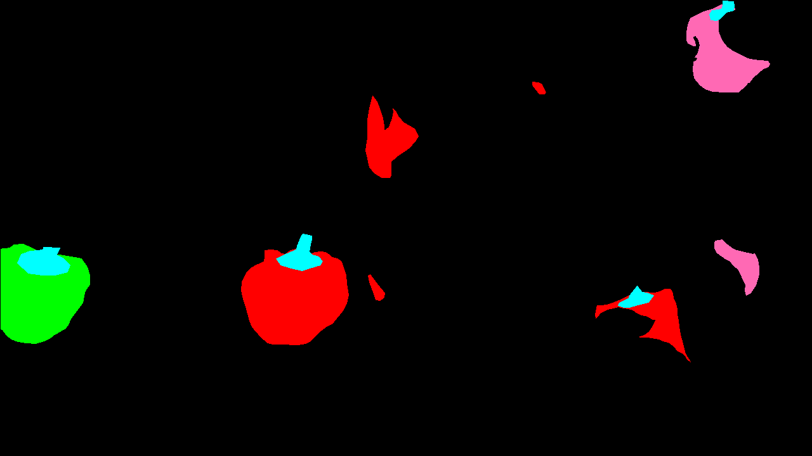

# GoldenAnpu-SubClassAnnotation
Provides annotation support for the GoldenAnpu sweet pepper dataset to convert it to the University of Bonn BUP variants.

This GUI was created in PyQt6.

# Create the virtual environment

Using python3 create your virtual environment

You may need to follow [this](https://askubuntu.com/questions/1434956/install-qt6-on-22-04) guide to install PyQt6 on your machine.

```python3 -m venv venv-GUI```


```>>> . venv-GUI/bin/activate```

```>>> pip3 install -r requirements.txt```


# Download the GoldenAnpu Sweet Pepper Dataset

Go to [here](https://github.com/dataset-ninja/sweet-pepper) and then click on the ```DOWNLOAD.md``` document and follow the prompts.

You'll find the meta file for their dataset [here](files/meta.json) that you need to put in the root directory you downloaded.

# Run the annotation tool

```>>> python main.py --root <root location of the dataset> --imageloc <direct location to the images> --annoloc <direct location to the image jsons> --output <where you'd like to save the corrosponding smap and imap images>```

# How to use the annotation tool



This is a basic subclass annotation tool for existing instance-based semantic segmentation datasets that have json files in the ```supervisely``` library type fashion.

The main image is displayed on the left panel with the object outlined based on the colours in the [meta](files/meta.json) file, you can change these as you wish.

The middle panel is the zoomed in and cropped object. On the right is the subclass buttons.

```MRed == mixed red```

```MYellow == mixed yellow```

For each annotation per image the button for the currently annotated sub-class will be depressed. If this is incorrect, you need to press that wrong button then select the correct sub-class.
Once you have either changed the sub-class or are happy with them you hit the next button and the next annotation will be displayed.

If you made a mistake, you can hit the back button and you will go back to the previous annotation. **WARNING** if you go back far enough that you enter the previous image you will start that image from the beginning!

Finally, there is no save function, if you want to start again from a particular image you can use the ```image index``` drop down menu.
Look in the ```--output``` directory, work out which image you are up to, then select that image from the drop down menu.


# Colour in the smap and check the imap indexs

This is a little function to make sure everything is working how you expected it to.
It colours in the smap and prints out the indexs to the masks in the imap per semantic class.

```>>> python main.py --colourin --annoloc <path to your panoptic files> --imgprefix <the prefix of the image you want to read in the smap and imap of minus the extension>```

You should get something like:



```
The classes in the smap are ['background', 'Red', 'Green', 'MRed', 'Peduncle']
The instances in the imap are:
         background [0]
         Red [1 2 3 4 5]
         Green [1]
         MRed [1 2]
         Peduncle [1 2 3 4]
```
